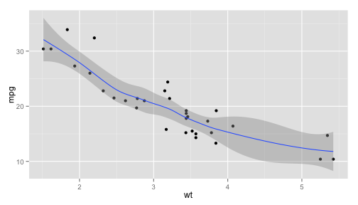

## Introduction

Thank you for checking out my Shiny App. Here is a short introduction to get started using this App. This App uses R's GGPlot2 and some of its features to render the plot, which will be displayed in the 'Plot' tab. 

Data loaded is from R Base package's 'mtcars' which contain data extracted from the 1974 Motor Trend US magazine, and comprises of fuel consumption and 10 aspects of automobile design and performance for 32 automobiles (1973-74 models). 

The sidebar panel allows you to choose the key axis (X & Y) as well as a third optional axis (Z) which will be shown in color. 

The sidebar panel also allows you to change your plot size, enable jitter, smoothing (works well on non-factored dimensions) as well as use advanced facet plots (take note: complex facets might take slightly longer to render). 


--- .class #id 

## User Layout and UI script

The App's User Interface was designed with a left sidebarPanel featuring plot options and a mainPanel which contained 2 tabs
1. Tab 1: Introduction
2. Tab 2: Plot Result

The App's UI script contains the following form objects which interacts with users:

```r
selectInput('y', 'Y-axis', dropdownlist, dropdownlist[[1]]),
selectInput('x', 'X-axis', dropdownlist, dropdownlist[[2]]),
selectInput('color', 'Z-axis (optional)', c('None', dropdownlist)),
sliderInput('pointSize', 'Point Size', min=1, max=10, value=2, step=1, round=0),
checkboxInput('jitter', 'Jittered to reduce overplotting'),
checkboxInput('smooth', 'Smoothed conditional mean'),
selectInput('facet_row', 'Facet Row', c(None='.', dropdownlist)),
selectInput('facet_col', 'Facet Column', c(None='.', dropdownlist))
tabPanel('Plot', plotOutput('plot'))
```
Take note, some drop down list were added a 'None' option with value '.'

--- .class #id 

## Server script

The App's server script first instatiates a copy of mtcars and factorizes a few vectors.

```r
mtcars1 <- mtcars
mtcars1$cyl <- factor(mtcars1$cyl)      mtcars1$vs <- factor(mtcars1$vs)
mtcars1$am <- factor(mtcars1$am)        mtcars1$gear <- factor(mtcars1$gear)
mtcars1$carb <- factor(mtcars1$carb)
```

Next, server renders the plot based on the initial 'onLoad' and user set values.


```r
p <- ggplot(datasetx(),aes_string(x=input$x, y=input$y))+geom_point(size=input$pointSize)
if (input$color != 'None')      p <- p + aes_string(color=input$color)
facets <- paste(input$facet_row, '~', input$facet_col)
if (facets != '. ~ .')          p <- p + facet_grid(facets)
if (input$jitter)               p <- p + geom_jitter()
if (input$smooth)               p <- p + geom_smooth()
```


--- .class #id 
## Exploration

In our own analysis using this App, we saw a relationship between cars' MPG and Weight (wt). When we analyzed further (outside this App), we found that cars will decrease MPG by 2.5 for every 1000lb increase in weight after adjusting variables horsepower, cylinder and transmission. 

We hope that this App would allow you to explore and find patterns for your analysis. Thanks.

 

